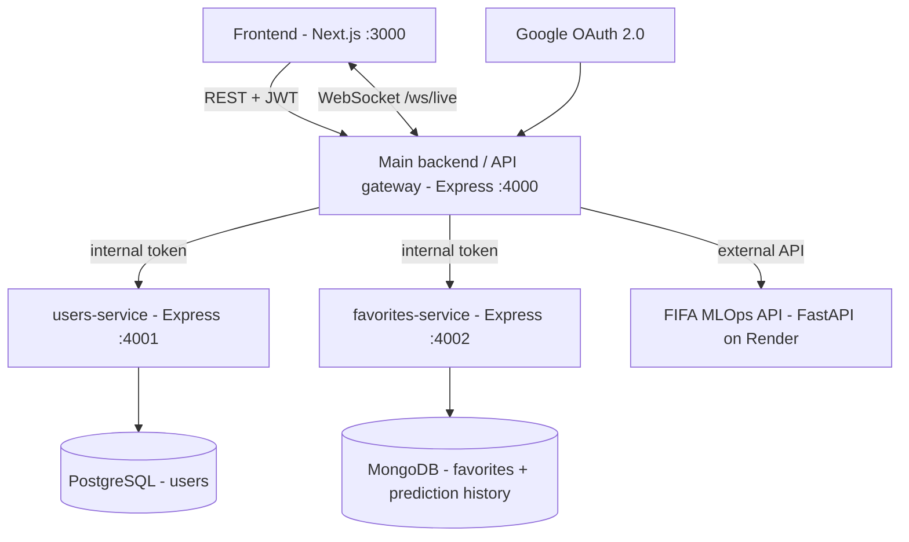

# WorldCup Hub

Full stack JavaScript application (microservice architecture) for the 2026
World Cup: match predictions powered by an external ML API, favorite teams and
live scores.

Built for the "Building a Production-Ready Full Stack JS App" final project.

## Architecture



| Component | Tech | Port | Database |
|---|---|---|---|
| `frontend/` | Next.js (React) | 3000 | — |
| `main-backend/` | Node.js + Express (gateway, auth, WebSocket) | 4000 | — |
| `services/users-service/` | Node.js + Express | 4001 | **PostgreSQL** |
| `services/favorites-service/` | Node.js + Express | 4002 | **MongoDB** |
| External API | FIFA World Cup MLOps backend (FastAPI) | — | — |

## API paradigms (2)

1. **REST** — `main-backend` exposes `/api/v1/*` (predictions, favorites,
   history, matches), consumed by the frontend and by external clients.
2. **WebSocket** — `ws://localhost:4000/ws/live?token=<jwt>` pushes live match
   updates to connected clients every 60 seconds (server push, no polling from
   the client).

## Authentication

- **Google OAuth 2.0** (authorization code flow) on the gateway:
  `GET /auth/google` → Google consent screen → `GET /auth/google/callback` →
  the gateway exchanges the code, upserts the user in `users-service`
  (PostgreSQL) and redirects to the frontend with a signed **JWT** (12h).
- The frontend stores the JWT and sends it as `Authorization: Bearer <token>`
  on every call. `/dashboard` is a protected route: without a valid token the
  user is redirected to the login page (same on any 401 from the API).
- Microservices are not reachable from the outside: they require an
  `x-internal-token` shared secret that only the gateway knows (403 otherwise).
- **Dev login** (`GET /auth/dev-login`) is available only when
  `ALLOW_DEV_LOGIN=true`, so the app can be developed without Google
  credentials. Never enable it in production.

## API as a Service (demo with/without JWT)

External consumers can call the REST API with a JWT.

```bash
# 1. Without JWT -> 401 access denied
curl -X POST http://localhost:4000/api/v1/predict \
  -H "content-type: application/json" \
  -d '{"homeTeam":"France","awayTeam":"Argentina"}'
# {"error":"Access denied","message":"Missing JWT. Provide an Authorization: Bearer <token> header."}

# 2. Get a token (dev mode) — in production this comes from the Google login
TOKEN=$(curl -s "http://localhost:4000/auth/dev-login?email=demo@test.dev" | jq -r .token)

# 3. With JWT -> prediction from the external ML API
curl -X POST http://localhost:4000/api/v1/predict \
  -H "Authorization: Bearer $TOKEN" \
  -H "content-type: application/json" \
  -d '{"homeTeam":"France","awayTeam":"Argentina","stage":"GROUP_STAGE"}'
# {"prediction":"home_win","probabilities":{...}}
```

Same calls work from Postman: set the `Authorization` header to
`Bearer <token>`.

## External API integration (bonus)

Predictions and live matches are served by our **FIFA World Cup MLOps
project** (FastAPI + MLflow model registry, deployed on Render):
`https://fifa-backend-production.onrender.com`. The gateway consumes it in
[main-backend/src/services/fifaClient.js](main-backend/src/services/fifaClient.js).

## Endpoints (gateway)

| Method | Path | Auth | Description |
|---|---|---|---|
| GET | `/health` | — | Service health |
| GET | `/auth/google` | — | Start Google login |
| GET | `/auth/google/callback` | — | OAuth callback, issues JWT |
| GET | `/auth/me` | JWT | Current user |
| POST | `/api/v1/predict` | JWT | ML prediction (external API) + history log |
| GET | `/api/v1/matches` | JWT | Live World Cup matches |
| GET/POST | `/api/v1/favorites` | JWT | List / add favorite teams |
| DELETE | `/api/v1/favorites/:team` | JWT | Remove a favorite |
| GET | `/api/v1/history` | JWT | Prediction history |
| WS | `/ws/live?token=<jwt>` | JWT | Live score push |

## Getting started

Prerequisites: Node.js ≥ 20, Docker.

```bash
# 1. Databases (PostgreSQL + MongoDB)
docker compose up -d

# 2. Environment files
cp main-backend/.env.example main-backend/.env
cp services/users-service/.env.example services/users-service/.env
cp services/favorites-service/.env.example services/favorites-service/.env
cp frontend/.env.example frontend/.env
# Fill GOOGLE_CLIENT_ID / GOOGLE_CLIENT_SECRET (Google Cloud Console),
# or keep ALLOW_DEV_LOGIN=true for local development.

# 3. Install and run each service (4 terminals)
cd services/users-service && npm install && npm start
cd services/favorites-service && npm install && npm start
cd main-backend && npm install && npm start
cd frontend && npm install && npm run dev
```

Open http://localhost:3000, sign in, and use the dashboard.

### Google OAuth setup

In [Google Cloud Console](https://console.cloud.google.com/apis/credentials):
create an OAuth 2.0 Client ID (web application) with
`http://localhost:4000/auth/google/callback` as authorized redirect URI, then
put the client id/secret in `main-backend/.env`.

## Team

- Ilyesse Essalihi
- Diakite Diaby
- Queroy Adrien
